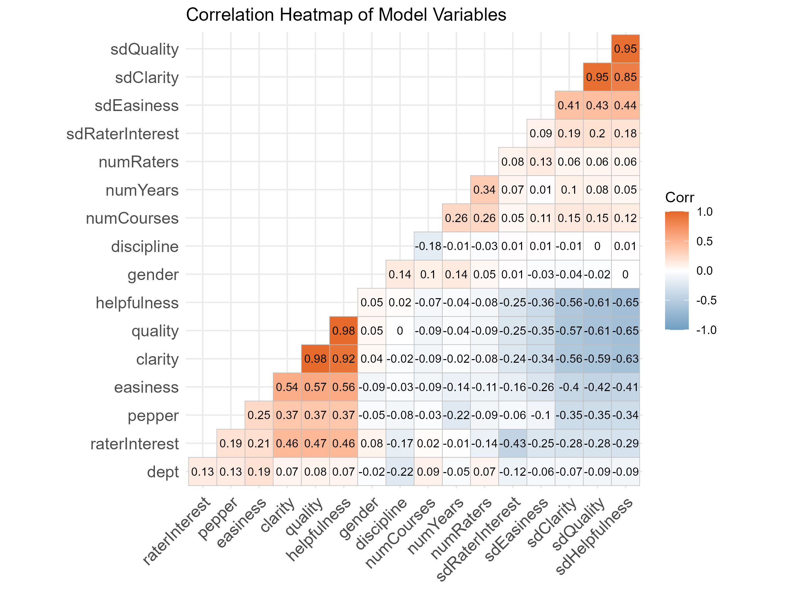
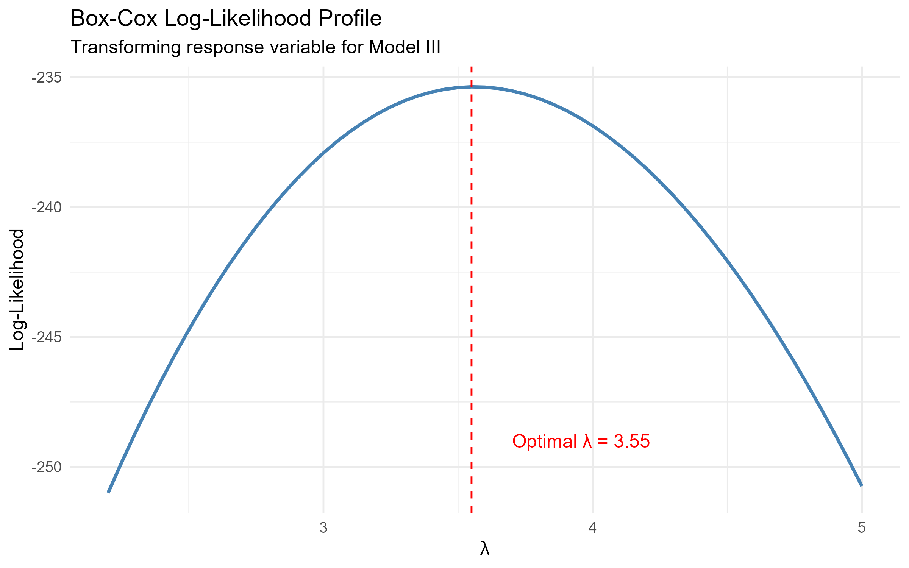
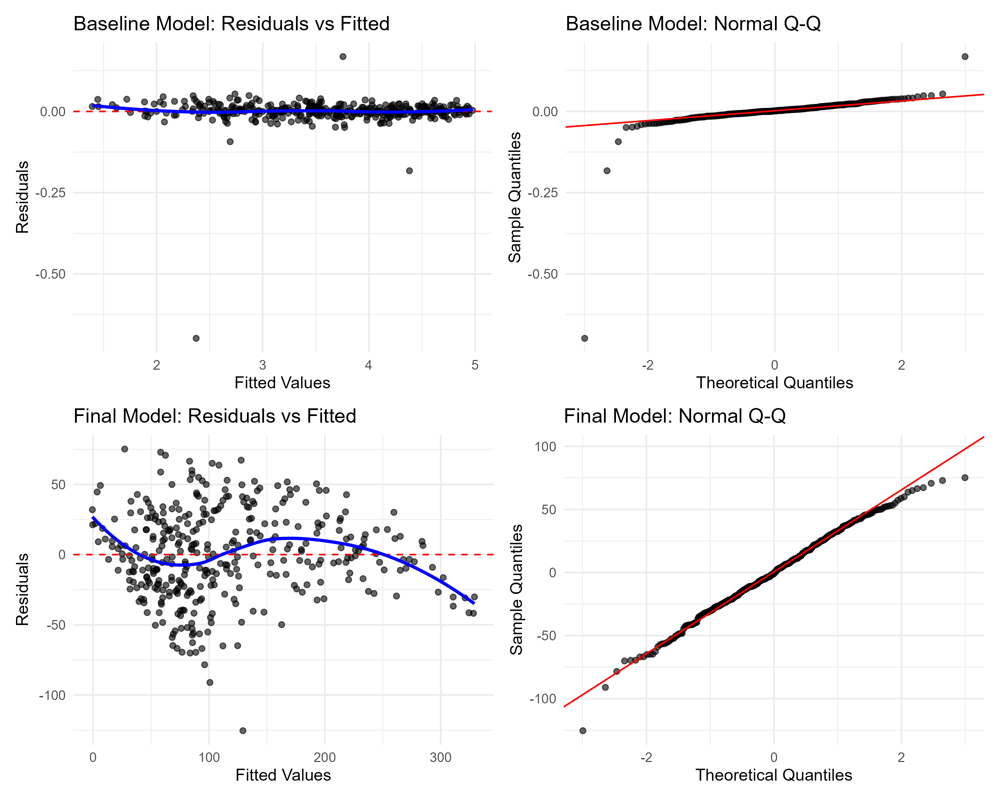

# Instructor Ratings Analysis: A Multiple Linear Regression Study


## Executive Summary
This project investigates key factors influencing overall instructor evaluation ratings across university courses using multiple linear regression techniques in **R**. Through iterative model building, exploratory diagnostic checks, and power transformations, this study addresses violations of key Ordinary Least Squares (OLS) assumptions (heteroscedasticity and non-normality) to deliver a robust, validated statistical model.

---

## Key Findings & Model Improvements
* **Multicollinearity Management:** Variance Inflation Factor (VIF) analysis revealed strong collinearity between course difficulty and workload metrics, guiding variable selection for candidate models.
* **OLS Assumption Violations:** Baseline Model I exhibited severe heteroscedasticity (funneling residuals) and non-normal right-skewed error distributions.
* **Optimal Remediation:** Application of a **Box-Cox Transformation ($\lambda \approx 3.55$)** stabilized residual variance and normalized error distribution, significantly improving model goodness-of-fit and parameter reliability.

---

## Statistical Methodology & Workflow

### 1. Exploratory Data Analysis
Before fitting regression models, bivariate relationships and feature correlations were evaluated to identify potential multicollinearity and preliminary predictor strength.

<p align="center">
  
</p>

---

### 2. Model Diagnostics & Transformation
To address standard regression assumption failures in the initial model, a Box-Cox log-likelihood profile was evaluated to determine the exact optimal power transformation for the response variable.

<p align="center">
  
</p>

* **Optimal Lambda:** $\lambda \approx 3.55$, indicating a strong power transformation requirement to satisfy homoscedasticity.

---

### 3. Model Comparison & Assumption Validation
By comparing baseline residual diagnostics against the final transformed specification, we confirmed that non-constant variance and heavy-tailed residual distributions were resolved.

<p align="center">
  
</p>

* **Baseline Model (Model I):** Curvature in the Normal Q-Q plot and distinct fan shapes in Residuals vs. Fitted values.
* **Final Transformed Model (Model IV):** Residuals are evenly dispersed around zero with errors closely tracking the theoretical normal line.

---

## Repository Structure

```text
├── analysis/
│   ├── Instructor-Ratings-Regression.Rmd          # Primary R Markdown document containing full analysis
├── docs/
│   └── index.html              # Rendered HTML report hosted via GitHub Pages
├── figures/
│   ├── correlation_heatmap.png
│   ├── boxcox_transformation.png
│   └── model_diagnostics_comparison.png
├── .gitignore
├── Instructor-Ratings-Regression.Rproj
├── License
└── README.md                   # Project overview and executive summary